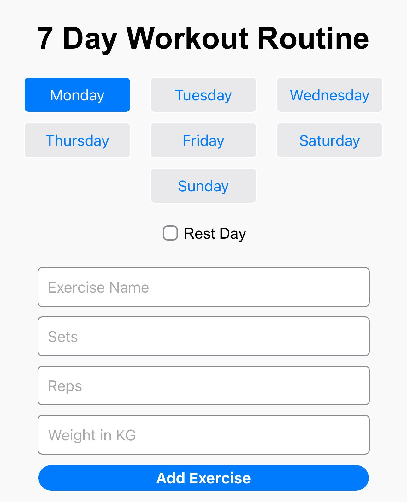

# 7 Days Workout Tracker

A simple, client-side workout tracking web application designed especially for mobile devices. The app lets you plan and track your weekly workout routines, mark exercises as completed, and manage rest days. All data is stored locally on your device using the browser's localStorage.

## Live Demo

Visit the website: https://clarencechoo.github.io/Workout-Tracking-Web-App/

Click the image below to watch the video tutorial.

## Features

- **7 Day Routine:**  
  Plan workouts for each day of the week with separate lists.
- **Rest Day Toggle:**  
  Mark any day as a rest day to hide the workout form and display a rest day message.
- **Add, Edit, and Delete Workouts:**  
  Easily manage your workouts with options to add new entries, edit existing ones using a modal, or delete them.
- **Mobile Responsive Design:**  
  Optimized for mobile screens with a vertically stacked form layout and a responsive day selector.
- **LocalStorage Persistence:**  
  Your workout data is saved locally on your device, ensuring it persists between sessions.

## Usage

1. **Select a Day:**  
   Use the day selector buttons to choose which day's workout you want to manage.
2. **Add a Workout:**  
   Fill out the form with the exercise name, number of sets, reps, and weight, then click "Add Exercise."
3. **Mark as Done:**  
   Check the box next to a workout to mark it as completed.
4. **Edit a Workout:**  
   Click the "Edit" button to open the modal, update the workout details, and save changes.
5. **Delete a Workout:**  
   Click the "Delete" button to remove a workout from the list.
6. **Rest Day:**  
   Toggle the "Rest Day" checkbox to mark a day as a rest day, which hides the workout form and shows a rest day message.

## How to Add Web App to Home Screen on iOS

If you're using an iPhone or iPad, you can easily add this web app to your home screen for quick access. Follow these steps:

1. **Open Safari:**  
   Launch the Safari browser on your iOS device and navigate to the website: [https://clarencechoo.github.io/Workout-Tracking-Web-App/]

2. **Tap the Share Icon:**  
   At the bottom of the screen, tap the **Share** button (a square with an arrow pointing upward).

3. **Select "Add to Home Screen":**  
   Scroll down (or look through the options) until you find **"Add to Home Screen"** and tap it.

4. **Confirm the App Name:**  
   A prompt will appear with the default name (which you can change if you wish). Tap **"Add"** in the upper-right corner.

Your web app icon will now appear on your home screen, just like a native app!

*Note: This feature is only available when using Safari on iOS.*